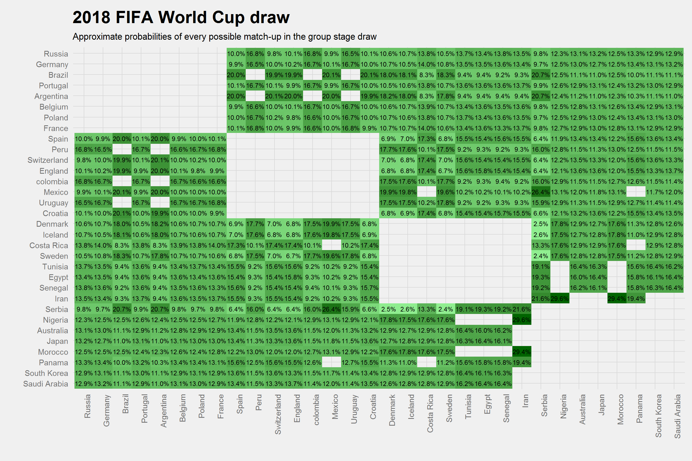

```{r setup, include=FALSE}
knitr::opts_chunk$set(echo = TRUE)
```

## Estimating draw probabilities using Monte Carlo simulations

FIFA World Cup draws are restricted by both inter-region limitations and pot limitations, which generally leads to tedious calculations of conditional probabilities for most combinations of match-ups (two countries/teams ending up in the same group). Since the expansion to 32 teams in 1998, the restrictions can generally be summarized as 

1. There may be two UEFA teams in one group. 
2. Countries from the other regions may not be matched with a country from its own region, i.e. one per group.
3. Teams are divided into four pots of 8 teams each, where one team from each pot is drawn into a group. E.g. usually Brazil and Germany won't be able to end up in the same group since they are both in the top seed (pot 1).

A simple method to estimate these probabilities is to simulate many sequences of draws and calculate the relative frequencies of every combination of match-ups. A function to this is provided in <wc18mcsim.R>. Moreover a less computational intensive function is provided in <wc18mcsim_alt.R>. Do note that the alternative function is hand-tailored specifically for the 2018 FIFA World Cup, and the drawback is  that it is not generalizable for future draws (which alternative 1 should be, save for any massive re-work of the draw process). 

Subsequently, the simulated data can be aggregated into relative frequencies of each match-up and neatly be visualized in a gridplot using <ggplot2>. This is illustrated below.


